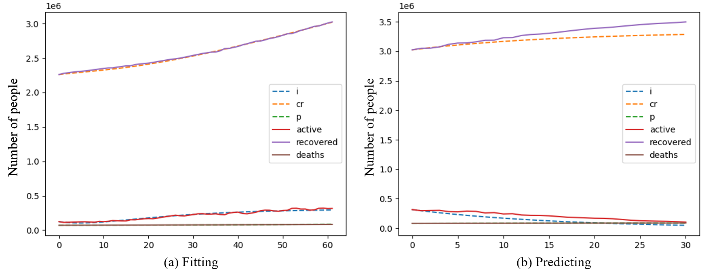
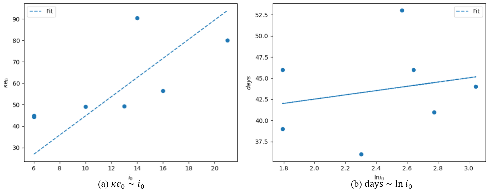

# [MAT3300 Final Project, 2021] Mathematical Modeling of COVID-19

This repository contains codes for MAT3300 final project, *Mathematical Modeling of COVID-19*. If you have any question regarding this project, feel free to contact me at dongmingli@link.cuhk.edu.cn.

## Requirement

Python3  
numpy  
pandas

## Data

Data from John Hoopkins Univerisity is used. The downloaded [data](https://github.com/CSSEGISandData/COVID-19/tree/master/csse_covid_19_data/csse_covid_19_time_series) has been placed under [data](./data) folder. *Note: since recovery data after Aug 4, 2021 is not available, only data before Aug 4, 2021 (include) is used.*

The data has been processed to recover active cases. If you wish to process it again, run
```bash
python data_preprocess.py
```

## Models (Simulators)

The four models are in [```simulator.py```](simulator.py). To run a simulation with a model, consult the following example

```python
from simulator import  DTMCSEIR, CTMCSEIR, ApproxSEIR, ExactSEIR

param = {
    'ae': 1e-8,
    'ai': 1e-8,
    'gamma': 0.01,
    'kappa': 0.1,
    'beta': 0.1,
    'rho': 0.01,
    'mu': 0.01,
    's': 5e7,
    'e': 1e3,
    'max_e': 1e3,
    'max_i': 1e3
}
init_state = {
    'i': 2,
    'r': 3,
    'p': 0,
    'cr': 3
}
model = DTMC(param, init_state)  # can be one of the four model
# run simulation for 100 days
for i in range(100):
    model.step()
# access the result
result = model.history
# visualize the result
import matplotlib.pyplot as plt
fig, ax = plt.subplots()
model.plot(ax)
plt.show()
```

*Note: the DTMC model is strongly recommended for its speed. Plus, **NEVER** use the CTMC model in real world setting. It is **SUPER SLOW** in large problems.*

## Fit the model

To obtain the fitting result in the [report](Mathematical-Modeling-of-COVID-19.pdf), run

```bash
python fit_predict_dtmc.py
```

*Note: slight differences are expected due to randomness in the DTMC model.*

To fit the model to another time period, change line 156 to
```python
# original
evaluate('2021-03-01', '2021-05-31', '2021-05-01',
# change to
evaluate('start date', 'end date', 'date to split the fitting and predicting period',
```

Please note that the fitting will last for a few hours because simulated annealing is slow.



## Outbreak analysis

First extract the outbreak periods (pre-extracted periods are in [data](./data)). If you wish to extract it again using your standard of selecting a outbreak period, run

```bash
python extract_explode_date.py
```

To obtain the result in the [report](Mathematical-Modeling-of-COVID-19.pdf), run

```bash
python fit_explode.py
```

